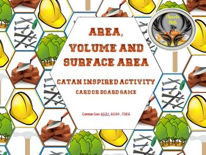

# Catan

board game style activity

------------------------------------------------------------------
------------------------------------------------------------------
## One Step Equations Catan

[One Step Equations Catan](https://www.teacherspayteachers.com/Product/One-Step-Equations-Catan-3507308)

#### Description

Description
This activity is loosely based on the board game Catan. Students will have to collect cards to build a house by solving different one step equations.

There are two versions to this game. One is with a game board and one is without.

Included:
*Color as well as Black and White versions
*Resource Cards - Hammer, Wood, Brick, Construction Hat and Nails
*House Cards - Window, Door, Roof and Walls
*Student Rules (2 versions based on game play)
*How to Build Student Cheat Sheets
*Teacher Explanations

Types of Problems:
*Hammer - Adding One Step Equations
*Wood - Subtracting One Step Equations
*Brick - Multiplying One Step Equations
*Construction Hat - Dividing One Step Equations
*Nails - Mixed Word Problems

Step into the construction zone and get started!

[One Step Equations Catan](https://www.teacherspayteachers.com/Product/One-Step-Equations-Catan-3507308)

Total Pages|  Answer Key |  Teaching Duration
-----------| ----------- | -------------
74 pages   |  N/A        |  45 minutes 

#### Standards

CCSS 6.EE.A.2      
Write, read, and evaluate expressions in which letters stand for numbers.  

CCSS 6.EE.A.2a   
Write expressions that record operations with numbers and with letters standing for numbers. For example, express the calculation “Subtract 𝘺 from 5” as 5 - 𝘺.  

CCSS 6.EE.B.6  
Use variables to represent numbers and write expressions when solving a real-world or mathematical problem; understand that a variable can represent an unknown number, or, depending on the purpose at hand, any number in a specified set.  

CCSS 6.EE.B.7  
Solve real-world and mathematical problems by writing and solving equations of the form 𝘹 + 𝘱 = 𝘲 and 𝘱𝘹 = 𝘲 for cases in which 𝘱, 𝘲 and 𝘹 are all nonnegative rational numbers.  

CCSS 7.EE.B.4  
Use variables to represent quantities in a real-world or mathematical problem, and construct simple equations and inequalities to solve problems by reasoning about the quantities.

------------------------------------------------------------------
------------------------------------------------------------------
## Decimal Operations Catan

[Decimal Operations Catan](https://www.teacherspayteachers.com/Product/Decimal-Operations-Catan-3508828)

#### Description

This activity is loosely based on the board game Catan. Students will have to collect cards to build a house by solving different decimal operations.

There are two versions to this game. One is with a game board and one is without.

Included:
*Color as well as Black and White versions
*Resource Cards - Hammer, Wood, Brick, Construction Hat and Nails
*House Cards - Window, Door, Roof and Walls
*Student Rules (2 versions based on game play)
*How to Build Student Cheat Sheets
*Teacher Explanations

Types of Problems:
*Hammer - Adding Decimals
*Wood - Subtracting Decimals
*Brick - Multiplying Decimals
*Construction Hat - Dividing Decimals
*Nails - Mixed Word Problems

Step into the construction zone and get started!

[Decimal Operations Catan](https://www.teacherspayteachers.com/Product/Decimal-Operations-Catan-3508828)

Total Pages|  Answer Key |  Teaching Duration
-----------| ----------- | -------------
74 pages   |  N/A        |  1 hour 

#### Standards

CCSS 6.NS.B.3  
Fluently add, subtract, multiply, and divide multi-digit decimals using the standard algorithm for each operation.

CCSS 5.NBT.B.7  
Add, subtract, multiply, and divide decimals to hundredths, using concrete models or drawings and strategies based on place value, properties of operations, and/or the relationship between addition and subtraction; relate the strategy to a written method and explain the reasoning used.

------------------------------------------------------------------
------------------------------------------------------------------
## Area, Volume and Surface Area Catan

[Area, Volume and Surgace Area Catan](https://www.teacherspayteachers.com/Product/Area-Volume-and-Surface-Area-Catan-3517790)

#### Description

This activity is loosely based on the board game Catan. Students will have to collect cards to build a house by solving math problems dealing with area, volume, surface area and nets.

There are two versions to this game. One is with a game board and one is without.

Included:
*Color as well as Black and White versions
*Resource Cards - Hammer, Wood, Brick, Construction Hat and Nails
*House Cards - Window, Door, Roof and Walls
*Student Rules (2 versions based on game play)
*How to Build Student Cheat Sheets
*Teacher Explanations

Types of Problems:
*Hammer - Area of Squares, Rectangles, Triangles, Trapezoids, Parallelograms and Kites.
*Wood - Volume of Cubes, Rectangular Prisms, Triangular Prisms, Cylinders, Rectangular Pyramids and Triangular Pyramids.
*Brick - Surface Area of Cubes, Rectangular Prisms, Triangular Prisms and Trapezoidal Prisms.
*Construction Hat - Nets with and without Surface Area of Cubes, Rectangular Prisms, Triangular Prisms, Trapezoidal Prisms, Cylinders, Rectangular Pyramids and Triangular Pyramids
*Nails - Mixed Word Problems

Not teaching one of the above listed shapes? No problem, simply remove those cards! There will be plenty left for game play.

Step into the construction zone and get started!

[Area, Volume and Surgace Area Catan](https://www.teacherspayteachers.com/Product/Area-Volume-and-Surface-Area-Catan-3517790)

Total Pages|  Answer Key |  Teaching Duration
-----------| ----------- | -------------
74 pages   |  N/A        |  1 hour 

#### Standards

CCSS 6.G.A.1  
Find the area of right triangles, other triangles, special quadrilaterals, and polygons by composing into rectangles or decomposing into triangles and other shapes; apply these techniques in the context of solving real-world and mathematical problems.

CCSS 6.G.A.4  
Represent three-dimensional figures using nets made up of rectangles and triangles, and use the nets to find the surface area of these figures. Apply these techniques in the context of solving real-world and mathematical problems.

CCSS 7.G.B.6  
Solve real-world and mathematical problems involving area, volume and surface area of two- and three-dimensional objects composed of triangles, quadrilaterals, polygons, cubes, and right prisms.