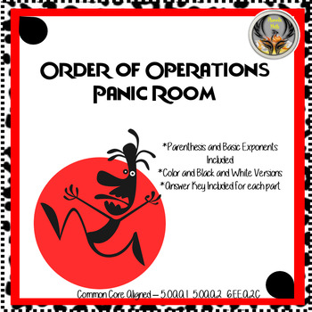
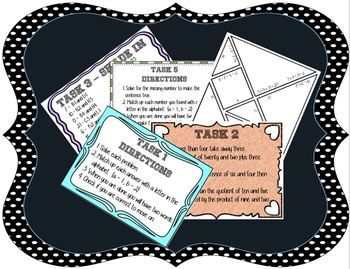

# Panic Rooms

Can your students solve the puzzles in time?

Your students are trapped in the room with a limited amount of time to make it out! This activity is based on the Panic/Mystery Rooms for adults. The goal is at the end of the tasks the students will have a completed famous phrase.

## Order of Operations Panic! Room

#### Description

Students will have 5 different tasks to complete in order to make it out:

1. Decode using Order of Operations to solve for 2 words.

2. Decode by writing out number sentences from words and solving using Order of Operations to solve for 1 word.

3. Solve and/or write number sentences based on words to shade in 1 word using Order of Operations.

4. Solve using Order of Operations on 6 different tangram puzzles that will create 1 word.

5. Solve using Order of Operations for the missing number to make the number sentence true.

This activity can be played Panic or Casual style based on your class. It can also be transformed into station activities.

Students love the challenges of combining math with puzzles. They also love the competition of who will make it out!

[Order of Operations Panic! Room](https://www.teacherspayteachers.com/Product/Order-of-Operations-Panic-Room-3470166?st=3466a9ca4f821b58210c69182f729e5e) 

## Unit Rate/Better Buy Panic Room

#### Description
 

Students will have 5 different tasks to complete in order to make it out:

1. Solve math problems to put a puzzle together to form a word.

2. Solve using unit rates to shade in a mystery word.

3. Students move around the room in a scavenger hunt of math problems to combine letters into a word.

4. Solve a crossword where students find special letters to form a word.

5. Students use better buy questions to search a picture for mysterious unknowns to complete the panic room.

This activity can be played Panic or Casual style based on your class. It can also be transformed into station activities.

Students love the challenges of combining math with puzzles. They also love the competition of who will make it out!

[Unit Rate/Better Buy Panic Room](https://www.teacherspayteachers.com/Product/Unit-RateBetter-Buy-Panic-Room-4276194?st=3466a9ca4f821b58210c69182f729e5e)

## Two-Step Equations Panic! Room

#### Description 

This is two activities depending on your students level/ability. Section 1 focuses on solving Two-Step Equations with NO negatives and Section 2 focuses on solving Two-Step Equations WITH negatives.

Students will have 6 different tasks to complete in order to make it out:

1. Decode using Two-Step Equations to solve for 2 words.

2. Decode by writing out and solving Two-Step Equations from words to solve for 2 word.

3. Decode with symbols by solving Two-Step Equations.

4. Solve using Two-Step Equations on 3 different tangram puzzles that will create 1 word.

5. Solve and/or write Two-Step Equations to shade in 1 part of a word.

6. Solve using Two-Step Equations to put the puzzle pieces together to make the second half of the last word.

This activity can be played Panic or Casual style based on your class. It can also be transformed into station activities.

Students love the challenges of combining math with puzzles. They also love the competition of who will make it out!

[Two-Step Equations Panic! Room](https://www.teacherspayteachers.com/Product/Two-Step-Equations-Panic-Room-3502604?st=3466a9ca4f821b58210c69182f729e5e)

## Integers Panic! Room

#### Description

Students will have 5 different tasks to complete in order to make it out:

1. Decode using Integers to solve for 1 word.

2. Solve using Integers on 3 different tangram puzzles that will create 2 words.

3. Decode using Integers in word problems to solve for 1 word.

4. Solve using Integers to shade in 2 mystery words.

5. Solve using Integers with word problems on puzzle pieces for the final word to complete the mystery phrase.

This activity can be played Panic or Casual style based on your class. It can also be transformed into station activities.

Students love the challenges of combining math with puzzles. They also love the competition of who will make it out!

[Integers Panic! Room](https://www.teacherspayteachers.com/Product/Integers-Panic-Room-3998327?st=3466a9ca4f821b58210c69182f729e5e)