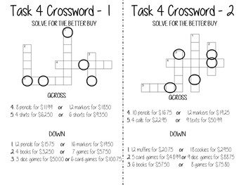

# Panic Rooms

Can your students solve the puzzles in time?

Your students are trapped in the room with a limited amount of time to make it out! This activity is based on the Panic/Mystery Rooms for adults. The goal is at the end of the tasks the students will have a completed famous phrase.

-----------------------------------------------------------
-----------------------------------------------------------

## Order of Operations Panic! Room

  
[Order of Operations Panic! Room](https://www.teacherspayteachers.com/Product/Order-of-Operations-Panic-Room-3470166?st=3466a9ca4f821b58210c69182f729e5e)

#### Description

Students will have 5 different tasks to complete in order to make it out:

1. Decode using Order of Operations to solve for 2 words.

2. Decode by writing out number sentences from words and solving using Order of Operations to solve for 1 word.

3. Solve and/or write number sentences based on words to shade in 1 word using Order of Operations.

4. Solve using Order of Operations on 6 different tangram puzzles that will create 1 word.

5. Solve using Order of Operations for the missing number to make the number sentence true.

This activity can be played Panic or Casual style based on your class. It can also be transformed into station activities.

Students love the challenges of combining math with puzzles. They also love the competition of who will make it out!

  

Total Pages|  Answer Key |  Teaching Duration
-----------| ----------- | -------------
39 pages   |  Included        |  1 hour 

#### Standards

CCSS 5.OA.A.1  
Use parentheses, brackets, or braces in numerical expressions, and evaluate expressions with these symbols.

CCSS 5.OA.A.2  
Write simple expressions that record calculations with numbers, and interpret numerical expressions without evaluating them. For example, express the calculation “add 8 and 7, then multiply by 2” as 2 × (8 + 7). Recognize that 3 × (18932 + 921) is three times as large as 18932 + 921, without having to calculate the indicated sum or product.

CCSS 6.EE.A.2c  
Evaluate expressions at specific values of their variables. Include expressions that arise from formulas used in real-world problems. Perform arithmetic operations, including those involving whole-number exponents, in the conventional order when there are no parentheses to specify a particular order (Order of Operations). For example, use the formulas V = s³ and A = 6 s² to find the volume and surface area of a cube with sides of length s = 1/2.

[Order of Operations Panic! Room](https://www.teacherspayteachers.com/Product/Order-of-Operations-Panic-Room-3470166?st=3466a9ca4f821b58210c69182f729e5e)

---------------------------------------------------------------------------------
---------------------------------------------------------------------------------

## Unit Rate/Better Buy Panic Room

  
[Unit Rate/Better Buy Panic Room](https://www.teacherspayteachers.com/Product/Unit-RateBetter-Buy-Panic-Room-4276194?st=3466a9ca4f821b58210c69182f729e5e)

#### Description
 

Students will have 5 different tasks to complete in order to make it out:

1. Solve math problems to put a puzzle together to form a word.

2. Solve using unit rates to shade in a mystery word.

3. Students move around the room in a scavenger hunt of math problems to combine letters into a word.

4. Solve a crossword where students find special letters to form a word.

5. Students use better buy questions to search a picture for mysterious unknowns to complete the panic room.

This activity can be played Panic or Casual style based on your class. It can also be transformed into station activities.

Students love the challenges of combining math with puzzles. They also love the competition of who will make it out!

 
 
 

[Unit Rate/Better Buy Panic Room](https://www.teacherspayteachers.com/Product/Unit-RateBetter-Buy-Panic-Room-4276194?st=3466a9ca4f821b58210c69182f729e5e)

Total Pages|  Answer Key |  Teaching Duration
-----------| ----------- | -------------
60 pages   |  Included   |  1 hour 

#### Standards

CCSS 6.RP.A.2  
Understand the concept of a unit rate 𝘢/𝘣 associated with a ratio 𝘢:𝘣 with 𝘣 ≠ 0, and use rate language in the context of a ratio relationship. For example, “This recipe has a ratio of 3 cups of flour to 4 cups of sugar, so there is 3/4 cup of flour for each cup of sugar.” “We paid $75 for 15 hamburgers, which is a rate of $5 per hamburger.”

CCSS 6.RP.A.3b  
Solve unit rate problems including those involving unit pricing and constant speed. For example, if it took 7 hours to mow 4 lawns, then at that rate, how many lawns could be mowed in 35 hours? At what rate were lawns being mowed?

--------------------------------------------------------------
--------------------------------------------------------------
## Two-Step Equations Panic! Room

  
[Two-Step Equations Panic! Room](https://www.teacherspayteachers.com/Product/Two-Step-Equations-Panic-Room-3502604?st=3466a9ca4f821b58210c69182f729e5e) 

#### Description 

This is two activities depending on your students level/ability. Section 1 focuses on solving Two-Step Equations with NO negatives and Section 2 focuses on solving Two-Step Equations WITH negatives.

Students will have 6 different tasks to complete in order to make it out:

1. Decode using Two-Step Equations to solve for 2 words.

2. Decode by writing out and solving Two-Step Equations from words to solve for 2 word.

3. Decode with symbols by solving Two-Step Equations.

4. Solve using Two-Step Equations on 3 different tangram puzzles that will create 1 word.

5. Solve and/or write Two-Step Equations to shade in 1 part of a word.

6. Solve using Two-Step Equations to put the puzzle pieces together to make the second half of the last word.

This activity can be played Panic or Casual style based on your class. It can also be transformed into station activities.

Students love the challenges of combining math with puzzles. They also love the competition of who will make it out!
  
[Two-Step Equations Panic! Room](https://www.teacherspayteachers.com/Product/Two-Step-Equations-Panic-Room-3502604?st=3466a9ca4f821b58210c69182f729e5e)

Total Pages|  Answer Key |  Teaching Duration
-----------| ----------- | -------------
104 pages   |  Included   |  1 hour 

#### Standards

CCSS 7.EE.B.3   
Solve multi-step real-life and mathematical problems posed with positive and negative rational numbers in any form (whole numbers, fractions, and decimals), using tools strategically. Apply properties of operations to calculate with numbers in any form; convert between forms as appropriate; and assess the reasonableness of answers using mental computation and estimation strategies. For example: If a woman making $25 an hour gets a 10% raise, she will make an additional 1/10 of her salary an hour, or $2.50, for a new salary of $27.50. If you want to place a towel bar 9 3/4 inches long in the center of a door that is 27 1/2 inches wide, you will need to place the bar about 9 inches from each edge; this estimate can be used as a check on the exact computation.

CCSS 7.EE.B.4 
Use variables to represent quantities in a real-world or mathematical problem, and construct simple equations and inequalities to solve problems by reasoning about the quantities.

CCSS 8.EE.C.7 
Solve linear equations in one variable.

-----------------------------------------------------------
-----------------------------------------------------------
## Integers Panic! Room
  
[Integers Panic! Room](https://www.teacherspayteachers.com/Product/Integers-Panic-Room-3998327?st=3466a9ca4f821b58210c69182f729e5e)
#### Description

Students will have 5 different tasks to complete in order to make it out:

1. Decode using Integers to solve for 1 word.

2. Solve using Integers on 3 different tangram puzzles that will create 2 words.

3. Decode using Integers in word problems to solve for 1 word.

4. Solve using Integers to shade in 2 mystery words.

5. Solve using Integers with word problems on puzzle pieces for the final word to complete the mystery phrase.

This activity can be played Panic or Casual style based on your class. It can also be transformed into station activities.

Students love the challenges of combining math with puzzles. They also love the competition of who will make it out!

[Integers Panic! Room](https://www.teacherspayteachers.com/Product/Integers-Panic-Room-3998327?st=3466a9ca4f821b58210c69182f729e5e)

Total Pages|  Answer Key |  Teaching Duration
-----------| ----------- | -------------
39 pages   |  Included   |  1 hour 

#### Standards

CCSS 7.NS.A.1  
Apply and extend previous understandings of addition and subtraction to add and subtract rational numbers; represent addition and subtraction on a horizontal or vertical number line diagram.

CCSS 7.NS.A.2  
Apply and extend previous understandings of multiplication and division and of fractions to multiply and divide rational numbers.